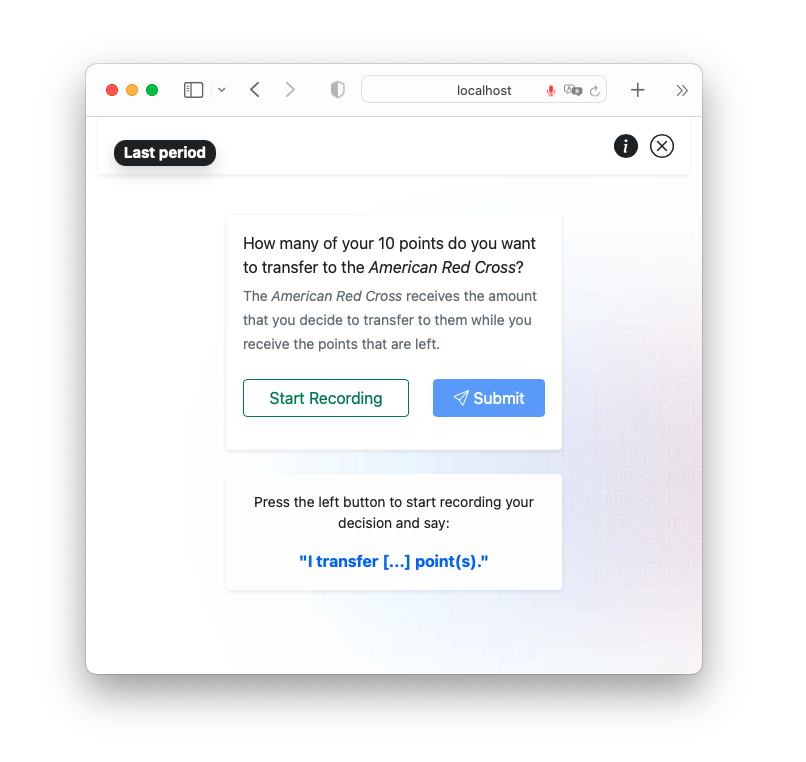

# Say it out loud 📢

This project contains a dictator game where participants receive an endowment and can decide whether and how much they 
want to donate to some charity.

Importantly, participants encounter one of two interfaces to communicate their decision: They either type their decision 
using a classic text input or they make a voice recording that is analyzed using a speech-to-text engine. 
Which type of interface a participant encounters is determined randomly.

## 🚏 How you can access a demo
You can find the experiment's [Demo here](https://ibt-hsg.herokuapp.com/). A click on the app called _Charity_ 
creates a session and redirects you to a page containing several URLs. 
Click on the _Session-wide demo link_ to open the experiment.

## 📊 Analysis plan (WIP)
The repository also contains an [analysis plan](https://github.com/Howquez/say-it-out-loud/tree/main/analyses/pre-registered) 
that documents how the eventual data is analyzed.

At this point, the analysis plan describes (1) how the voice recordings, 
that are stored as a long `base64` string, are decoded into `wav` files,
(2) passed to speech-to-text engine and (3) how one can extract quantities from that text using [R](https://www.r-project.org/).

You can either generate your own data using the demo,
work with some data I [generated](https://github.com/Howquez/say-it-out-loud/tree/main/data/raw) or 
use data I [simulated](https://github.com/Howquez/say-it-out-loud/tree/main/data/raw).

## 🐛 Please note:
The app is tested on a MacBook using Google Chrome Version 103.0.5060.134 (x86_64).
While one can run the app using Safari as well, there are some problems analyzing the resulting voice recordings.
Further testing (and bug fixes) are required.